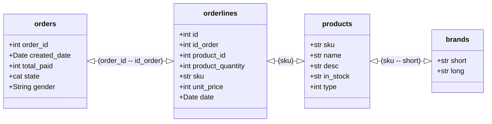

# Pandas_Eniac
Solving some Business Questions using group of CSV files (as DB), and analyzing them via Pandas

## CSV Structure

## Columns description
#### orders.csv – Every row in this file represents an order.
- order_id – a unique identifier for each order
- created_date – a timestamp for when the order was created
- total_paid – the total amount paid by the customer for this order, in euros
- state 
  - “Shopping basket” – products have been placed in the shopping basket, but the order has not been processed yet.
  - “Pending” – the shopping basket has been processed, but payment confirmation is pending.
  - “Completed” – the order has been placed and paid, and the transaction is completed.
  - “Cancelled” – the order has been cancelled and the payment returned to the customer.
#### orderlines.csv – Every row represents each one of the different products involved in an order.
- id – a unique identifier for each row in this file
- id_order – corresponds to orders.order_id
- product_id – an old identifier for each product, nowadays not in use
- product_quantity – how many units of that product were purchased on that order
- sku – stock keeping unit: a unique identifier for each product
- unit_price – the unitary price (in euros) of each product at the moment of placing that order
- date – timestamp for the processing of that product
#### products.csv
- sku – stock keeping unit: a unique identifier for each product
- name – product name
- desc – product description
- in_stock – whether or not the product was in stock at the moment of the data extraction
- type – a numerical code for product type
#### brands.csv
- short – the 3-character code by which the brand can be identified in the first 3 characters of products.sku
- long – brand name
